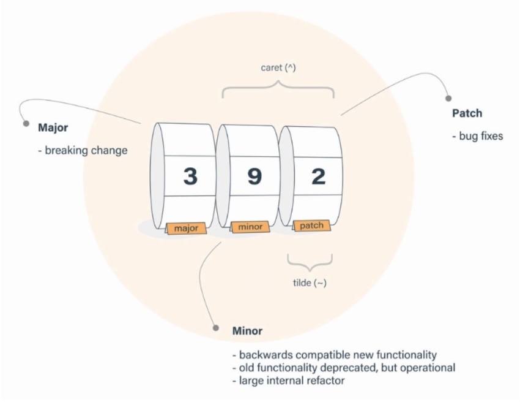

# npm - Platzi

  
  <h5 style="font-weight:bold;" >npm by aomine</h5>

## Index

- [1. Introducción](#introducción)
  - [¿Qué es npm?](#qué-es-npm)
- [2. npm comands](#npm-comands)
  - [npm init](#npm-init)

## npm comands

### npm init

#### npm init -y

  <small><a href="#index">🡡 volver al inicio</a></small>

### npm set

#### npm set init.author.name <NAME>
#### npm set init.author.name <EMAIL>
#### npm set init.license <LICENSE>

  <small><a href="#index">🡡 volver al inicio</a></small>

### npm install

install puede ser abreviado con **i**

instala todas las dependencias que se encuentren en package.json

#### npm i <PACKAGE>@<VERSION>

instala un paquete con una versión establecida

Podemos usar __lasted__ para traernos la ultima versión

#### npm i <PACKAGE> --opcional

--opcional puede ser abreviado con **-O**

instalación de un paquete de manera opcional en la sección de __optionalDependencies__ 

#### npm i <PACKAGE> --force

--force puede ser abreviado con **-f**

Fuerca la instalación de un paquete

  <small><a href="#index">🡡 volver al inicio</a></small>

### npm list

Buscara todos los paquetes instalados de forma local en nuestro proyecto

#### npm list -g --depth 0

Buscara todos los paquetes instalados de forma global en nustro equipo

### npm outdate

Te muestra todos los paquetes desactualizados

#### npm outdate --dd

Nos muestra todo el proceso que sucede por detras

### npm update

actualiza todos los paquetes

#### npm update <PACKAGE>

actualiza el paquete especifico

#### npm audit <PACKAGE> --depth 2

actualiza el paquete especifico y tambien las dependencias de este mismo

### npm uninstall

#### npm uninstall <PACKAGE>

remueve un paquete del __package.json__ y de __node_modules__

#### npm uninstall <PACKAGE> --no-save

remueve un paquete de __node_modules__ pero no del __package.jon__

### npm cache

#### npm cache clean --force

Elimina el cache de nuestro sistema

#### npm cache verify

Para verificar que la cache se limpio correctamente

### npm audit

Analiza todas las vulnerabilidades y paquetes desactualizados

### npm audit --json

Analiza todas las vulnerabilidades y paquetes desactualizados y te lo muestra en formato json

#### npm audit fix

Arregla todas las vulnerabilidades que pueda

### npm link

añade el paquete de forma local a nuestro pc

## Versiones

  

## Publicar un paquete

* Tendremos que registrarnos en la web de npm

* En nuestra consola tendremos que ejecutar `npm login` y registarnos

* Para verificar que nos logueamos correctamente usaremos `npm whoami` nos tendra que devolver el usuario

* Y por último para publicar nuestro paquete usaremos `npm publish`

* Y listo ahora nuestro paquete estara disponible para instalarlo en cualquier proyecto

### npm version

Para cambiar la version de nuestro proyecto cada vez que actualizamos el código

Para esto podemo ejecutar alguno de esteos comandos según el tipo de actualización

#### npm version major
#### npm version minor
#### npm version patch
